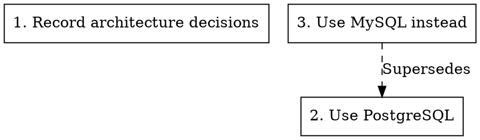

# generate

Generate documentation from ADRs.

## Usage

```
adrs generate <SUBCOMMAND>
```

## Subcommands

| Subcommand | Description |
|------------|-------------|
| `toc` | Generate a table of contents |
| `graph` | Generate a Graphviz dependency graph |

---

## generate toc

Generate a markdown table of contents.

### Usage

```
adrs generate toc [OPTIONS]
```

### Options

| Option | Description |
|--------|-------------|
| `-o, --output <FILE>` | Output file (default: stdout) |
| `-i, --intro <TEXT>` | Introduction text |
| `-l, --link-prefix <PREFIX>` | Prefix for ADR links |
| `-e, --epilogue <TEXT>` | Epilogue text |
| `--ng` | Use NextGen mode |
| `-C, --cwd <DIR>` | Working directory |
| `-h, --help` | Print help |

### Examples

#### Basic Table of Contents

```sh
adrs generate toc
```

Output:

```markdown
# Architecture Decision Records

* [1. Record architecture decisions](doc/adr/0001-record-architecture-decisions.md)
* [2. Use PostgreSQL for persistence](doc/adr/0002-use-postgresql-for-persistence.md)
* [3. API versioning strategy](doc/adr/0003-api-versioning-strategy.md)
```

#### Save to File

```sh
adrs generate toc -o doc/adr/README.md
```

#### Custom Introduction

```sh
adrs generate toc -i "# Project Decisions\n\nKey architectural choices:"
```

#### Link Prefix for Wikis

```sh
adrs generate toc -l "wiki/adr/"
```

---

## generate graph

Generate a Graphviz DOT graph showing ADR relationships.

### Usage

```
adrs generate graph [OPTIONS]
```

### Options

| Option | Description |
|--------|-------------|
| `-o, --output <FILE>` | Output file (default: stdout) |
| `--ng` | Use NextGen mode |
| `-C, --cwd <DIR>` | Working directory |
| `-h, --help` | Print help |

### Examples

#### Basic Graph

```sh
adrs generate graph
```

Output:



#### Save to File

```sh
adrs generate graph -o doc/adr/graph.dot
```

#### Render as PNG

Using Graphviz:

```sh
adrs generate graph | dot -Tpng -o doc/adr/graph.png
```

#### Render as SVG

```sh
adrs generate graph | dot -Tsvg -o doc/adr/graph.svg
```

### Graph Features

- Each ADR is a node with its number and title
- Links between ADRs are shown as edges
- Supersedes relationships use dashed lines
- Nodes link to their ADR files (clickable in SVG)

### Integration with CI

Generate and commit the graph automatically:

```yaml
- name: Generate ADR graph
  run: |
    adrs generate graph -o doc/adr/graph.dot
    dot -Tsvg doc/adr/graph.dot -o doc/adr/graph.svg

- name: Commit graph
  run: |
    git add doc/adr/graph.*
    git commit -m "docs: update ADR graph" || true
```

## Related

- [list](./list.md) - List ADRs
- [doctor](./doctor.md) - Check repository health
