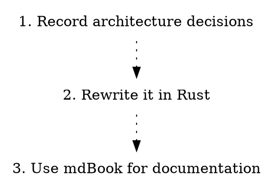

# generate

## Overview

The `generate` command fronts three options for generating output for use with other tools.

* toc - generate a Markdown table of contents
* graph - generate a [Graphviz](https://graphviz.org) representation of your ADRs
* book - generate a basic [mdBook](https://github.com/rust-lang/mdBook) representation of your ADRs

## Help

```sh
Generates summary documentation about the Architectural Decision Records

Usage: adrs generate <COMMAND>

Commands:
  toc    Generate a table of contents
  graph  Generate a graph of the ADRs
  book   Generate a book of the ADRs
  help   Print this message or the help of the given subcommand(s)

Options:
  -h, --help     Print help
  -V, --version  Print version
```

## Examples

### ToC

```sh
# Generate a Markdown Table of Contents for the local ADRs
adrs generate toc
```

Outputs the following on stdout:

```markdown
# Architecture Decision Records

* [1. Record architecture decisions](0001-record-architecture-decisions.md)
* [2. Rewrite it in Rust](0002-rewrite-it-in-rust.md)
* [3. Use mdBook for documentation](0003-use-mdbook-for-documentation.md)
```

### Graph

```sh
# Generate a Graphviz file graphing the ADRs and their relationships.
adrs generate graph
```



### Book

```sh
Generate a book of the ADRs

Usage: adrs generate book [OPTIONS]

Options:
  -p, --path <PATH>                Target path for the book directory [default: book]
  -o, --overwrite                  Overwrite existing directory
  -t, --title <TITLE>              Title of the book [default: "Architecture Decision Records"]
  -d, --description <DESCRIPTION>  Description of the book [default: "A collection of architecture decision records"]
  -a, --author <AUTHOR>            Author of the book
  -h, --help                       Print help
  -V, --version                    Print version
```

```sh
# Generate a basic mdBook based project for the current ADRs
adrs generate book
```

The `book` directory now contains a basic mdbook with:

* `book.toml' - the book's configuration
* `src/SUMMARY.md` - a Markdown file describing the structure of the book
* your ADR files - copied into the book and referenced by the `SUMMARY.md`

Get started by running `mdbook serve` in your `book` directory. See [mdBook](https://github.com/rust-lang/mdBook) for more information.

Note that the command is currently pretty destructive, but requires the `-o/--overwrite` flag to work on an existing directory.

## Issues

See the [cmd-generate](https://github.com/joshrotenberg/adrs/labels/cmd-generate) label for command specific issues.
