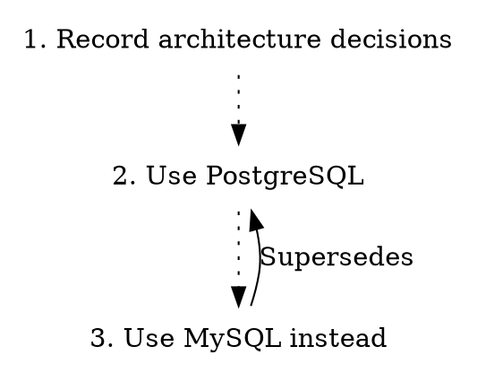

# generate

Generate documentation from ADRs.

## Usage

```
adrs generate <SUBCOMMAND>
```

## Subcommands

| Subcommand | Description |
|------------|-------------|
| `toc` | Generate a table of contents |
| `graph` | Generate a Graphviz dependency graph |
| `book` | Generate an mdbook |

---

## generate toc

Generate a markdown table of contents to stdout.

### Usage

```
adrs generate toc [OPTIONS]
```

### Options

| Option | Description |
|--------|-------------|
| `-o, --ordered` | Use ordered list (1. 2. 3.) instead of bullets |
| `-i, --intro <FILE>` | Prepend content from file |
| `-O, --outro <FILE>` | Append content from file |
| `-p, --prefix <PREFIX>` | Prefix for ADR links |
| `--ng` | Use NextGen mode |
| `-C, --cwd <DIR>` | Working directory |
| `-h, --help` | Print help |

### Examples

#### Basic Table of Contents

```sh
adrs generate toc
```

Output:

```markdown
* [1. Record architecture decisions](0001-record-architecture-decisions.md)
* [2. Use PostgreSQL for persistence](0002-use-postgresql-for-persistence.md)
* [3. API versioning strategy](0003-api-versioning-strategy.md)
```

#### Ordered List

```sh
adrs generate toc --ordered
```

Output:

```markdown
1. [1. Record architecture decisions](0001-record-architecture-decisions.md)
2. [2. Use PostgreSQL for persistence](0002-use-postgresql-for-persistence.md)
3. [3. API versioning strategy](0003-api-versioning-strategy.md)
```

#### Save to File

```sh
adrs generate toc > doc/adr/README.md
```

#### With Intro and Outro Files

```sh
adrs generate toc -i intro.md -O outro.md > doc/adr/README.md
```

#### Link Prefix for Wikis

```sh
adrs generate toc -p "wiki/adr/"
```

---

## generate graph

Generate a Graphviz DOT graph showing ADR relationships.

### Usage

```
adrs generate graph [OPTIONS]
```

### Options

| Option | Description |
|--------|-------------|
| `-p, --prefix <PREFIX>` | Prefix for node URLs |
| `-e, --extension <EXT>` | File extension for links (default: md) |
| `--ng` | Use NextGen mode |
| `-C, --cwd <DIR>` | Working directory |
| `-h, --help` | Print help |

### Examples

#### Basic Graph

```sh
adrs generate graph
```

Output:



#### Save to File

```sh
adrs generate graph > doc/adr/graph.dot
```

#### Render as PNG

Using Graphviz:

```sh
adrs generate graph | dot -Tpng -o doc/adr/graph.png
```

#### Render as SVG

```sh
adrs generate graph | dot -Tsvg -o doc/adr/graph.svg
```

#### HTML Links with Custom Extension

```sh
adrs generate graph -e html -p "/docs/adr/"
```

### Graph Features

- Each ADR is a node with its number and title
- Sequential ADRs are connected with dotted lines
- Explicit links between ADRs shown as solid edges with labels
- Nodes link to their ADR files (clickable in SVG)

---

## generate book

Generate an mdbook from your ADRs.

### Usage

```
adrs generate book [OPTIONS]
```

### Options

| Option | Description |
|--------|-------------|
| `-o, --output <DIR>` | Output directory (default: book) |
| `-t, --title <TITLE>` | Book title |
| `-d, --description <DESC>` | Book description |
| `--ng` | Use NextGen mode |
| `-C, --cwd <DIR>` | Working directory |
| `-h, --help` | Print help |

### Examples

#### Basic Book

```sh
adrs generate book
```

This creates a `book/` directory with:
- `book.toml` - mdbook configuration
- `src/SUMMARY.md` - table of contents
- `src/*.md` - copies of all ADR files

#### Custom Output Directory

```sh
adrs generate book -o docs/decisions
```

#### Custom Title and Description

```sh
adrs generate book -t "Project Architecture" -d "Key decisions for the project"
```

#### Build and Serve

After generating:

```sh
adrs generate book
cd book
mdbook serve
```

### Integration with CI

Generate and deploy the book automatically:

```yaml
- name: Generate ADR book
  run: |
    adrs generate book
    cd book && mdbook build

- name: Deploy to GitHub Pages
  uses: peaceiris/actions-gh-pages@v3
  with:
    github_token: ${{ secrets.GITHUB_TOKEN }}
    publish_dir: ./book/book
```

## Related

- [list](./list.md) - List ADRs
- [doctor](./doctor.md) - Check repository health
