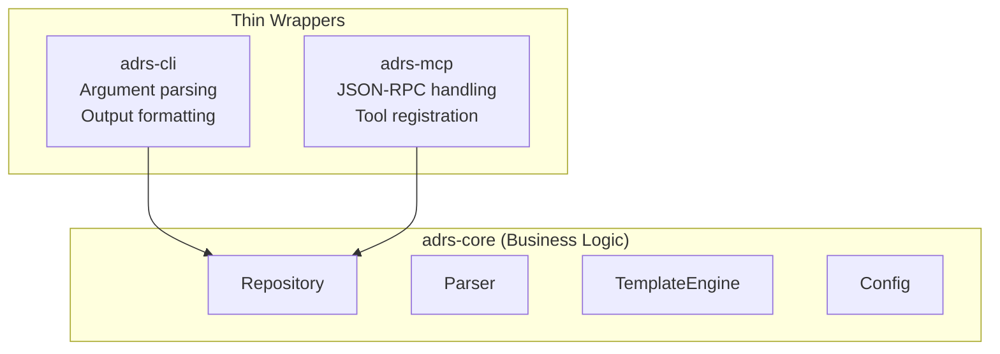
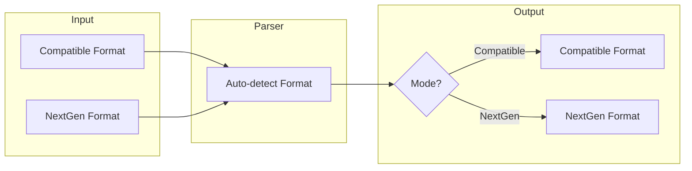
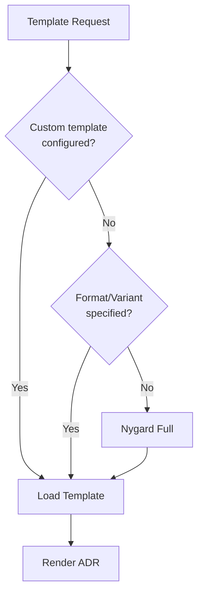

# Core Concepts

<!-- toc -->

## Library-First Architecture

All business logic lives in `adrs-core`. The CLI and MCP server are thin wrappers.

### Benefits

- **Testability**: Core logic can be tested without CLI overhead
- **Reusability**: Other tools can use `adrs-core` directly
- **Separation of concerns**: I/O handling separate from business logic
- **Flexibility**: Multiple interfaces to the same functionality

### Guidelines

1. **All logic in `adrs-core`**: No business logic in CLI or MCP
2. **CLI is a thin wrapper**: Only argument parsing and output formatting
3. **MCP is a thin wrapper**: Only JSON-RPC handling and tool registration

> **Related:** [ADR-0004: Library-first Architecture](../../reference/adrs/0004-library-first-architecture.md)

## Dual Mode Operation

The tool operates in two modes that affect **output format only**:

### Compatible Mode (Default)

- Uses `.adr-dir` for configuration
- Writes plain markdown without frontmatter
- Status in `## Status` section
- Links as markdown in Status section
- Full compatibility with adr-tools

### NextGen Mode

- Uses `adrs.toml` for configuration
- Writes YAML frontmatter
- Status in frontmatter
- Links as structured YAML
- Supports MADR 4.0.0 fields (decision-makers, consulted, informed)

### Key Principle: Read Both, Write One

- Parser auto-detects input format
- Mode only affects output
- Mixed repositories work for reading

> **Related:** [ADR-0005: Dual Mode Operation](../../reference/adrs/0005-dual-mode-compatible-and-nextgen.md)

## Template System

Templates use minijinja (Jinja2 syntax) for generating ADR content.

### Built-in Templates

| Format | Description |
|--------|-------------|
| Nygard | Classic adr-tools format |
| MADR | MADR 4.0.0 format |

### Variants

| Variant | Description |
|---------|-------------|
| Full | All sections with guidance comments |
| Minimal | Essential sections only |
| Bare | All sections, no guidance |
| BareMinimal | Core sections only, empty |

### Template Resolution

1. Custom template from config (`templates.custom`)
2. Built-in template by format and variant
3. Default (Nygard Full)

> **Related:** [ADR-0007: Use minijinja](../../reference/adrs/0007-use-minijinja-for-templates.md)

## See Also

- [Library Guide](../lib/README.md) - Using these concepts in code
- [Architecture ADRs](../../reference/adrs/README.md) - Design decisions
