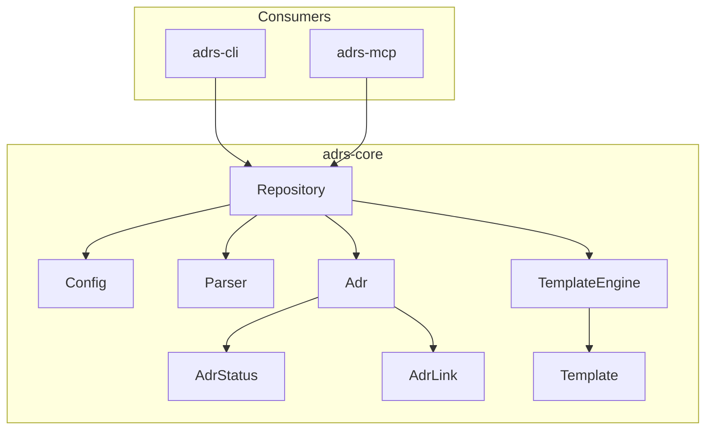

# Library Usage

`adrs-core` is the core library powering the `adrs` CLI and MCP server. You can use it directly in your Rust projects to manage ADRs programmatically.

## Installation

Add to your `Cargo.toml`:

```toml
[dependencies]
adrs-core = "0.7"
```

## Quick Start

```rust
use adrs_core::{Repository, Adr, AdrStatus};

fn main() -> adrs_core::Result<()> {
    // Open an existing repository
    let repo = Repository::open(".")?;

    // List all ADRs
    for adr in repo.list()? {
        println!("{}: {} [{}]", adr.number, adr.title, adr.status);
    }

    // Create a new ADR
    let mut adr = Adr::new(2, "Use PostgreSQL for persistence");
    adr.context = "We need a database for our application.".into();
    adr.decision = "We will use PostgreSQL.".into();
    adr.consequences = "We need PostgreSQL expertise.".into();

    repo.create(&adr)?;

    Ok(())
}
```

## Core Types

### `Repository`

The main entry point for ADR operations.

```rust
use adrs_core::Repository;

// Open existing repository
let repo = Repository::open(".")?;

// Open or use defaults if not found
let repo = Repository::open_or_default(".");

// Initialize new repository
let repo = Repository::init(".", None, false)?;  // Compatible mode
let repo = Repository::init(".", None, true)?;   // NextGen mode
```

**Key methods:**

| Method | Description |
|--------|-------------|
| `list()` | List all ADRs |
| `get(number)` | Get ADR by number |
| `find(query)` | Fuzzy search by title |
| `search(query)` | Full-text search |
| `create(&adr)` | Create new ADR |
| `update(&adr)` | Update existing ADR |
| `update_status(number, status)` | Change ADR status |
| `link(source, target, kind)` | Link two ADRs |
| `next_number()` | Get next available number |

### `Adr`

Represents a single Architecture Decision Record.

```rust
use adrs_core::{Adr, AdrStatus, AdrLink, LinkKind};

let mut adr = Adr::new(1, "Use Rust");
adr.status = AdrStatus::Accepted;
adr.context = "We need a systems language.".into();
adr.decision = "We will use Rust.".into();
adr.consequences = "Team needs Rust training.".into();

// MADR 4.0.0 fields
adr.decision_makers = vec!["Alice".into(), "Bob".into()];
adr.consulted = vec!["Carol".into()];
adr.informed = vec!["Dave".into()];
adr.tags = vec!["language".into(), "tooling".into()];

// Add links
adr.add_link(AdrLink {
    target: 2,
    kind: LinkKind::Supersedes,
});
```

### `AdrStatus`

```rust
use adrs_core::AdrStatus;

let status = AdrStatus::Proposed;
let status = AdrStatus::Accepted;
let status = AdrStatus::Deprecated;
let status = AdrStatus::Superseded;
let status = AdrStatus::Custom("on-hold".into());
```

### `Config`

Configuration discovery and management.

```rust
use adrs_core::{discover, Config, ConfigMode};

// Discover configuration
let discovered = discover(".")?;
println!("ADR dir: {:?}", discovered.config.adr_dir);
println!("Mode: {:?}", discovered.config.mode);

// Check mode
match discovered.config.mode {
    ConfigMode::Compatible => println!("adr-tools compatible"),
    ConfigMode::NextGen => println!("NextGen with frontmatter"),
}
```

## Templates

Generate ADR content from templates.

```rust
use adrs_core::{TemplateEngine, TemplateFormat, TemplateVariant, Adr};

let engine = TemplateEngine::new()
    .with_format(TemplateFormat::Madr)
    .with_variant(TemplateVariant::Minimal);

let adr = Adr::new(1, "Use PostgreSQL");
let content = engine.render(&adr)?;
```

**Formats:** `Nygard`, `Madr`

**Variants:** `Full`, `Minimal`, `Bare`, `BareMinimal`

## Linting & Validation

```rust
use adrs_core::{lint_all, check_repository, IssueSeverity};

let repo = Repository::open(".")?;

// Lint all ADRs
let report = lint_all(&repo)?;
for issue in report.issues {
    match issue.severity {
        IssueSeverity::Error => eprintln!("Error: {}", issue.message),
        IssueSeverity::Warning => eprintln!("Warning: {}", issue.message),
    }
}

// Repository-level checks
let report = check_repository(&repo)?;
```

## Import/Export

JSON-ADR format support for interoperability.

```rust
use adrs_core::{export_repository, import_to_directory, ImportOptions};

// Export
let json = export_repository(&repo)?;

// Import
let options = ImportOptions::default();
let result = import_to_directory("path/to/adrs", &json, options)?;
println!("Imported {} ADRs", result.imported);
```

## Error Handling

All fallible operations return `adrs_core::Result<T>`.

```rust
use adrs_core::{Repository, Error};

match Repository::open(".") {
    Ok(repo) => println!("Opened repository"),
    Err(Error::NotFound(path)) => println!("No config at {:?}", path),
    Err(Error::Parse { path, message, .. }) => {
        println!("Parse error in {:?}: {}", path, message)
    }
    Err(e) => println!("Error: {}", e),
}
```

## Module Overview



| Module | Description |
|--------|-------------|
| `repository` | ADR CRUD operations |
| `config` | Configuration discovery |
| `types` | Core types (`Adr`, `AdrStatus`, `AdrLink`) |
| `template` | Template rendering |
| `parse` | ADR file parsing |
| `lint` | Validation and linting |
| `export` | JSON-ADR import/export |

## See Also

- [API Documentation](https://docs.rs/adrs-core) - Full Rust API docs
- [Library Requirements](./requirements/README.md) - Design requirements
- [ADR-0004: Library-first Architecture](../../reference/adrs/0004-library-first-architecture.md)
