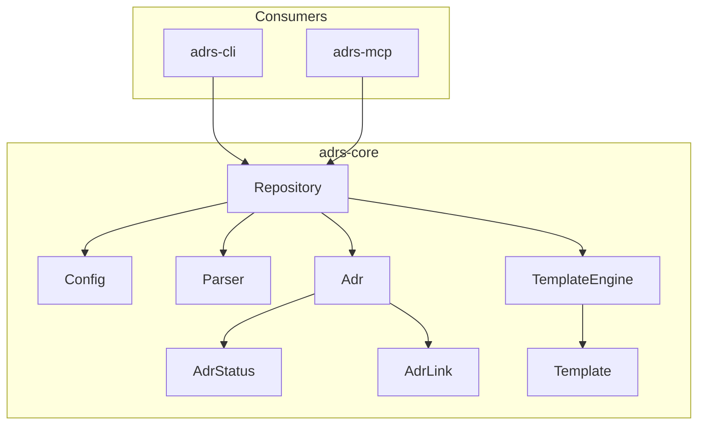
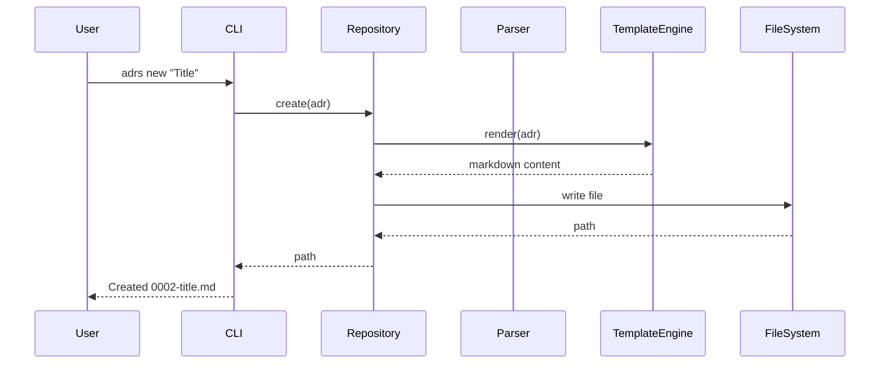

# Module Overview

<!-- toc -->

## Architecture



## Module Summary

| Module | Description | Public |
|--------|-------------|--------|
| `repository` | ADR CRUD operations | Yes |
| `config` | Configuration discovery | Yes |
| `types` | Core types (`Adr`, `AdrStatus`, `AdrLink`) | Yes |
| `template` | Template rendering | Yes |
| `parse` | ADR file parsing | Yes |
| `lint` | Validation and linting | Yes |
| `export` | JSON-ADR import/export | Yes |
| `error` | Error types | Yes |
| `doctor` | Legacy health checks (deprecated) | Yes |

## Module Details

### repository

The main entry point for ADR operations. Handles file I/O, configuration, and coordinates other modules.

```rust
pub struct Repository { /* ... */ }

impl Repository {
    pub fn open(root: impl Into<PathBuf>) -> Result<Self>;
    pub fn open_or_default(root: impl Into<PathBuf>) -> Self;
    pub fn init(root: impl Into<PathBuf>, adr_dir: Option<PathBuf>, ng: bool) -> Result<Self>;
    pub fn list(&self) -> Result<Vec<Adr>>;
    pub fn get(&self, number: u32) -> Result<Option<Adr>>;
    pub fn create(&self, adr: &Adr) -> Result<PathBuf>;
    // ...
}
```

### config

Configuration discovery and management. Supports both `.adr-dir` (Compatible) and `adrs.toml` (NextGen) formats.

```rust
pub fn discover(root: impl AsRef<Path>) -> Result<DiscoveredConfig>;

pub struct Config {
    pub adr_dir: PathBuf,
    pub mode: ConfigMode,
    pub templates: TemplateConfig,
}

pub enum ConfigMode {
    Compatible,
    NextGen,
}
```

### types

Core domain types for representing ADRs, statuses, and links.

See [Core Types](./types-core.md) for detailed documentation.

### template

Template engine using minijinja (Jinja2 syntax).

```rust
pub struct TemplateEngine { /* ... */ }
pub enum TemplateFormat { Nygard, Madr }
pub enum TemplateVariant { Full, Minimal, Bare, BareMinimal }
```

### parse

ADR file parsing. Auto-detects format (Compatible vs NextGen) and extracts structured data.

```rust
pub struct Parser { /* ... */ }

impl Parser {
    pub fn parse(&self, content: &str) -> Result<Adr>;
    pub fn parse_file(&self, path: &Path) -> Result<Adr>;
}
```

### lint

Validation and linting for ADRs and repositories.

```rust
pub fn lint_adr(adr: &Adr) -> LintReport;
pub fn lint_all(repo: &Repository) -> Result<LintReport>;
pub fn check_repository(repo: &Repository) -> Result<LintReport>;

pub struct LintReport {
    pub issues: Vec<Issue>,
}

pub enum IssueSeverity { Error, Warning }
```

### export

JSON-ADR format support for interoperability with other tools.

```rust
pub fn export_adr(adr: &Adr) -> JsonAdr;
pub fn export_repository(repo: &Repository) -> Result<JsonAdrBulkExport>;
pub fn import_to_directory(path: &Path, json: &str, options: ImportOptions) -> Result<ImportResult>;
```

## Data Flow



## See Also

- [Core Types](./types-core.md) - Detailed type documentation
- [API Documentation](https://docs.rs/adrs-core) - Full Rust API docs
