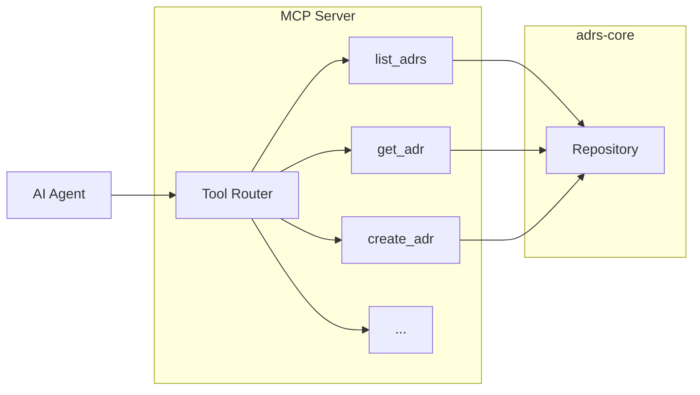

# MCP Tools

The MCP server provides 15 tools organized by function.

## Tool Summary

| Tool | Category | Description |
|------|----------|-------------|
| `list_adrs` | Read | List all ADRs with filters |
| `get_adr` | Read | Get full ADR content |
| `search_adrs` | Read | Search ADR content |
| `get_adr_sections` | Read | Get parsed sections |
| `get_related_adrs` | Read | Get linked ADRs |
| `get_repository_info` | Read | Repository metadata |
| `create_adr` | Write | Create new ADR |
| `update_status` | Write | Change status |
| `link_adrs` | Write | Create links |
| `update_content` | Write | Update sections |
| `update_tags` | Write | Manage tags |
| `bulk_update_status` | Write | Batch status updates |
| `validate_adr` | Analysis | Check structure |
| `compare_adrs` | Analysis | Compare two ADRs |
| `suggest_tags` | Analysis | Suggest tags |

## Tool Categories

### Read Operations

| Tool | Description |
|------|-------------|
| `list_adrs` | List all ADRs with optional status/tag filters |
| `get_adr` | Get full content of an ADR by number |
| `search_adrs` | Search ADR titles and content |
| `get_adr_sections` | Get ADR with parsed sections |
| `get_related_adrs` | Get all ADRs linked to/from a specific ADR |
| `get_repository_info` | Get repository configuration |

### Write Operations

| Tool | Description |
|------|-------------|
| `create_adr` | Create a new ADR (always 'proposed') |
| `update_status` | Change an ADR's status |
| `link_adrs` | Create bidirectional links |
| `update_content` | Update ADR sections |
| `update_tags` | Add or replace tags |
| `bulk_update_status` | Update multiple statuses |

### Analysis Tools

| Tool | Description |
|------|-------------|
| `validate_adr` | Check ADR structure |
| `compare_adrs` | Compare two ADRs |
| `suggest_tags` | Suggest relevant tags |

## Architecture

## See Also

- [MCP Overview](../README.md)
- [Adding Tools](../examples/add-tools.md)
